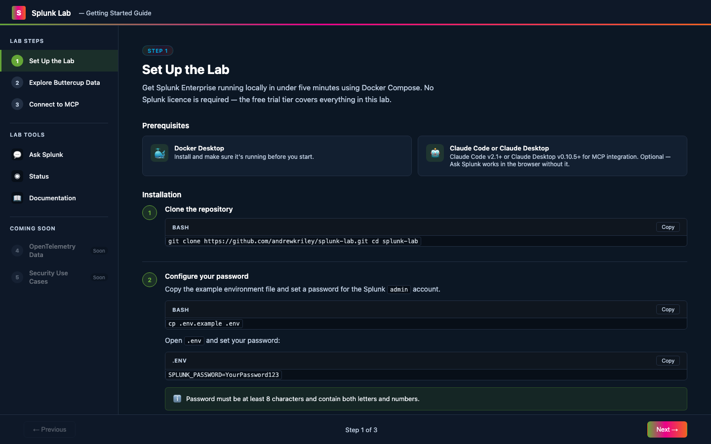
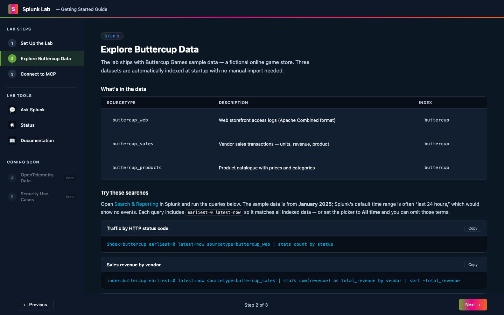
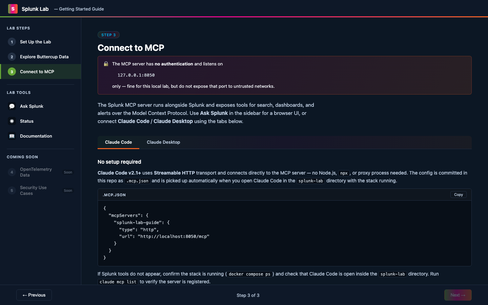
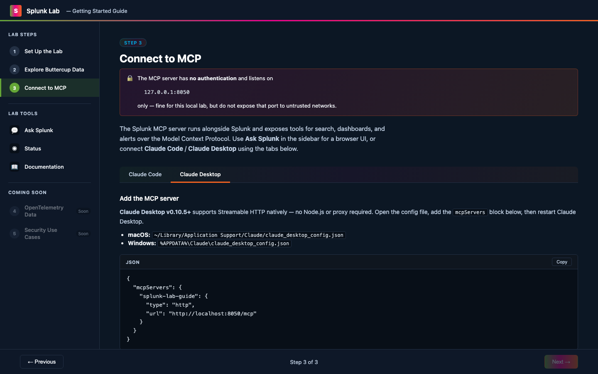
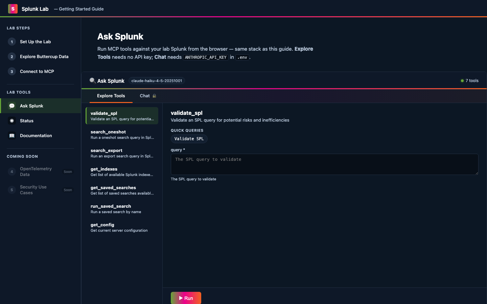
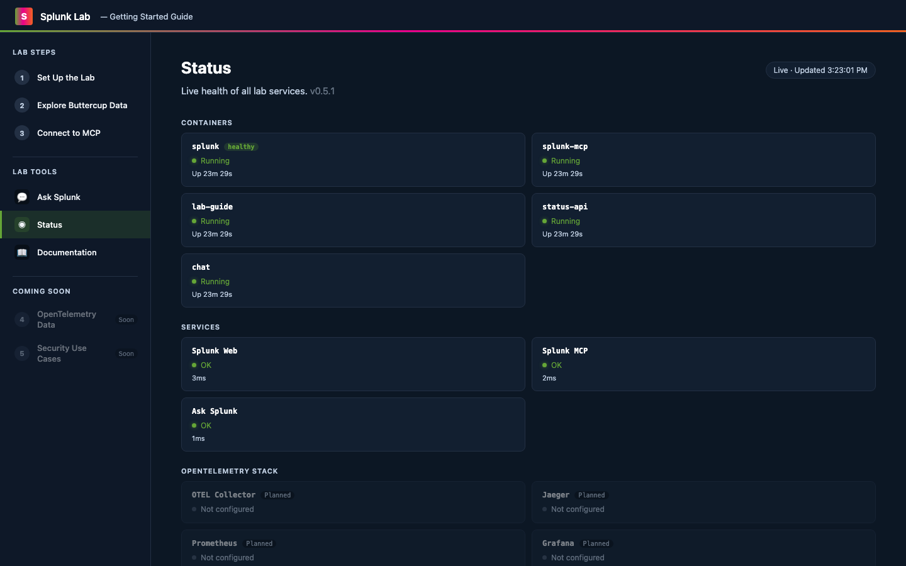
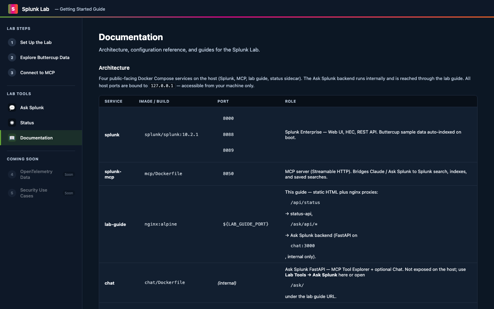

# Splunk Lab

[](https://github.com/andrewkriley/splunk-lab/releases/latest)

A demo environment for anyone looking to get a kick start with their Splunk learning journey in a self-hosted environment. Runs Splunk Enterprise in Docker with Buttercup Games sample data pre-loaded, the Splunk MCP server ready for Claude Code or Claude Desktop, and a built-in **Ask Splunk** interface for exploring MCP tools and querying Splunk via natural language. Prefer a hosted option? Try the [Splunk Cloud 14-day free trial](https://www.splunk.com/en_us/download/splunk-cloud.html).

```
docker compose up  →  Lab guide + Splunk Web UI + MCP server + Ask Splunk ready
```

**Lab guide (online preview):** https://andrewkriley.github.io/splunk-lab/

---

## Lab Guide

The lab guide at `http://localhost:3131` (also at [andrewkriley.github.io/splunk-lab](https://andrewkriley.github.io/splunk-lab/)) is the single interface for the lab. The left sidebar navigates between four setup steps, lab tools, and documentation.

### Step 1 — Set Up the Lab

Prerequisites, clone, configure `.env`, and start the stack with `docker compose up -d`. The step walks through each action and confirms readiness before moving on.



### Step 2 — Explore Buttercup Data

Describes the three Buttercup Games datasets (`buttercup_web`, `buttercup_sales`, `buttercup_products`) and provides ready-to-copy SPL queries for common analyses. Each query includes `earliest=0 latest=now` to match the January 2025 sample timestamps regardless of Splunk's default time picker.



### Step 3 — Connect to MCP

Tabbed instructions for connecting **Claude Code** and **Claude Desktop** to the MCP server using Streamable HTTP. Includes copy-ready config snippets and a troubleshooting table.

| Claude Code | Claude Desktop |
|---|---|
|  |  |

### Step 4 — Your first dashboard (Claude Code)

Walks through the **`/splunk-lab-dashboard-gen`** skill: prerequisites (stack, MCP, Hugging Face, `.claude/env.sh` with `SPLUNK_PASS` and `HF_TOKEN`), copy-ready prompts using the **`buttercup`** index, and where to find the live Splunk link when the run completes.

### Ask Splunk

Browser-based MCP interface — no Claude subscription required. **Explore Tools** lists every MCP tool with auto-generated forms and quick-query presets. **Chat** (optional, requires `ANTHROPIC_API_KEY`) adds natural-language querying via Claude.



### Status Dashboard

Live health of all lab services — container states, Splunk Web and MCP reachability, and OpenTelemetry stack placeholders. Auto-refreshes every 10 seconds.



### Documentation

Architecture reference, configuration table, environment variable descriptions, data flow diagram, and network topology — all in the browser alongside the lab.



---

## Prerequisites

- [Docker Desktop](https://www.docker.com/products/docker-desktop/) installed and running
- Claude Code (v2.1+) or Claude Desktop (v0.10.5+) for MCP integration — optional if you only use Ask Splunk in the browser
- A [Splunk Developer License](https://dev.splunk.com/enterprise/dev_license/) (free) to remove the 500 MB/day indexing limit

---

## Quickstart

### Option A — guided install (recommended for first-time setup)

```bash
git clone <this-repo>
cd splunk-lab
./install.sh
```

`install.sh` walks through `.env` configuration, starts the stack, waits for Splunk to be ready, confirms all services are up, and optionally creates `.claude/env.sh` (gitignored) for the `splunk-lab-dashboard-gen` skill. It also provides **Update** and **Reset** modes from its main menu.

### Option B — manual setup

**1. Clone and configure**

```bash
git clone <this-repo>
cd splunk-lab
cp .env.example .env
```

Open `.env` and set a password for the Splunk `admin` account:

```
SPLUNK_PASSWORD=YourPassword123
```

> Password must be at least 8 characters and contain letters and numbers.

**2. Start the lab**

```bash
docker compose up -d
```

Splunk takes ~60–90 seconds to initialise on first boot. Watch readiness:

```bash
docker compose logs -f splunk
```

When you see `Ansible playbook complete`, Splunk is ready.

**3. Open the lab**

- **Lab Guide:** http://localhost:3131 — click-through setup and search guide
- **Splunk Web UI:** http://localhost:8000
- **Username:** `admin`
- **Password:** the value you set in `.env`

Buttercup Games sample data is automatically indexed at startup — no manual steps required.

**Splunk Search time range:** sample timestamps are in **January 2025**. In **Search & Reporting**, set the time picker to **All time** (or paste SPL that includes `earliest=0 latest=now` after `index=buttercup`). The default **Last 24 hours** often shows no events for this lab.

---

## What's included

### Buttercup Games sample data

Three datasets are auto-indexed into the `buttercup` index:

| Sourcetype | Description |
|---|---|
| `buttercup_web` | Web storefront access logs (Apache Combined format) |
| `buttercup_sales` | Vendor sales transactions — units, revenue, product |
| `buttercup_products` | Product catalogue with prices and categories |

**Try these searches in Splunk:**

Sample events are dated **January 2025**. Splunk Web defaults to a short recent window (for example the last 24 hours), which would return no rows for this data. Use **All time** in the time-range picker, or keep the `earliest=0 latest=now` bounds in the searches below so they always match the sample data.

```spl
# Traffic by HTTP status code
index=buttercup earliest=0 latest=now sourcetype=buttercup_web | stats count by status

# Sales revenue by vendor
index=buttercup earliest=0 latest=now sourcetype=buttercup_sales | stats sum(revenue) as total_revenue by vendor | sort -total_revenue

# Top products by units sold
index=buttercup earliest=0 latest=now sourcetype=buttercup_sales | stats sum(units_sold) as total_units by product | sort -total_units

# Revenue trend over time
index=buttercup earliest=0 latest=now sourcetype=buttercup_sales | timechart span=1d sum(revenue) by vendor
```

### Lab Guide and Status Dashboard

The lab guide runs at `http://localhost:3131` and serves as the single interface for the lab:

- **Steps 1–3** — click-through setup and guided SPL exercises
- **Status** — live dashboard showing container health, Splunk Web and MCP service reachability, and OpenTelemetry stack placeholders (auto-refreshes every 10s)
- **Documentation** — reference material for the lab

The status backend (`status-api`) runs as a sidecar container and exposes `GET /api/status` via the nginx reverse proxy — no separate port required.

---

## Importing your own data

### From a CSV file

1. In Splunk Web, go to **Settings → Add Data → Upload**
2. Select your CSV file
3. Splunk will auto-detect the delimiter and preview the fields
4. Set the **Source Type** to `csv` (or create a custom one)
5. Choose the `main` index and click **Review → Submit**

Your data is immediately searchable:
```spl
index=main sourcetype=csv | head 20
```

### From an online source (HEC)

The HTTP Event Collector (HEC) is pre-enabled on port `8088`. Use the token from your `.env` file to send events from any HTTP client:

```bash
# Send a single event
curl -k https://localhost:8088/services/collector/event \
  -H "Authorization: Splunk ${SPLUNK_HEC_TOKEN}" \
  -d '{"event": {"message": "hello from HEC", "source": "my_app"}, "sourcetype": "my_sourcetype"}'
```

```bash
# Send a batch of events from a JSON file
curl -k https://localhost:8088/services/collector/event \
  -H "Authorization: Splunk ${SPLUNK_HEC_TOKEN}" \
  -d @events.json
```

Then search for your events:
```spl
index=main sourcetype=my_sourcetype
```

---

## Ask Splunk

A two-tab interface **inside the lab guide** at `http://localhost:3131/ask/` (sidebar **Lab Tools → Ask Splunk**) for exploring and querying Splunk through MCP. The FastAPI backend runs in the `chat` container on the internal network only; nginx on the lab guide proxies `/ask/api/*` to it so you use one host port.

### Explore Tools (no API key required)

The default tab lists all MCP tools with auto-generated forms, quick-query presets for common SPL operations, and raw JSON results. Use it to validate the MCP server works, learn the tool schemas, and run queries — no AI subscription needed.

### Chat (optional — requires Anthropic API key)

A natural-language chat interface that bridges Claude with Splunk via MCP tools. Ask questions in plain English and Claude will call the appropriate MCP tools to query Splunk and format the results.

**Setup:** Add your Anthropic API key to `.env`:

```
ANTHROPIC_API_KEY=sk-ant-...
```

Then restart: `docker compose up -d`. Open `http://localhost:3131/ask/` and switch to the **Chat** tab.

> The Chat tab requires an Anthropic API key. The Explore Tools tab works without one. All other lab features are unaffected.

---

## Skills

This project ships Claude Code skills that work directly with the lab. Skills are project-scoped — they appear automatically when Claude Code is opened from the `splunk-lab` directory.

### splunk-lab-dashboard-gen

Generates a full **Splunk Dashboard Studio** dashboard from any SPL query and deploys it live to the local Splunk instance.

**What it does:**
1. Runs your SPL via the `splunk-lab-guide` MCP
2. Generates a thematic background image via HuggingFace AI
3. Builds the Dashboard Studio JSON with the image embedded
4. Deploys to Splunk via REST API and returns a direct link

**Prerequisites:**

| Requirement | Setup |
|---|---|
| Lab stack running | `docker compose up -d` |
| `splunk-lab-guide` MCP | Configured in `.mcp.json` — no action needed |
| HuggingFace MCP | Connect via Claude Code MCP settings |
| `.claude/env.sh` | `SPLUNK_PASS`, minted `SPLUNK_API_TOKEN`, `HF_TOKEN` — see below (gitignored, never commit) |

**One-time `env.sh` setup:**

```bash
cp env.sh.example .claude/env.sh
chmod 600 .claude/env.sh
```

Open `.claude/env.sh` and set `SPLUNK_PASS` to match the `SPLUNK_PASSWORD` value in your `.env` file, and `HF_TOKEN` to your Hugging Face API token (`hf_...`) for dashboard background images. `SPLUNK_HOST` and `SPLUNK_USER` default to `localhost` and `admin` — correct for the local lab. Running `./install.sh` and accepting the skill prompt creates this file, **mints a Splunk REST `SPLUNK_API_TOKEN`** (audience `splunkd`) via the management API when Splunk is up, and can prompt for `HF_TOKEN`.

**Usage** — say to Claude:
> *"Generate a dashboard from index=buttercup, stats count by status, title: Web Traffic"*
> *"/splunk-lab-dashboard-gen Buttercup Sales Overview"*

**Output:** `~/dev/claude-created-dashboards/<slug>/` — background PNG, `dashboard.json`, wrapped XML. Live dashboard opens at `http://localhost:8000/en-US/app/search/<slug>`.

---

## MCP Integration

The Splunk MCP server runs alongside Splunk at **`http://localhost:8050/mcp`** using **Streamable HTTP** (MCP 2025-03-26) so Claude can call Splunk search, dashboards, and alerts. The image is built from Splunk’s [**splunk-mcp-server2**](https://github.com/splunk/splunk-mcp-server2) with lab overlays in `mcp/server.ts` and `mcp/splunkClient.ts`. **[Lab vs upstream — full delta](docs/splunk-mcp-customisations/README.md)**.

> **Security note:** The MCP endpoint requires no authentication and is bound to `127.0.0.1` only — it is not accessible from other machines on the network. This configuration is intentional for local demo use. Do not expose port `8050` to external networks.

### Claude Code

**Claude Code CLI v2.1+** supports Streamable HTTP natively (no `npx` or proxy). The repo root **`.mcp.json`** registers `splunk-lab-guide` → `http://localhost:8050/mcp`; it loads automatically when you open this project in Claude Code with the stack running.

Start a conversation once the stack is up:
> *"Search Splunk for HTTP 500 errors in the last 24 hours"*
> *"Show me the top 5 vendors by revenue"*
> *"Create a dashboard showing web traffic by status code"*

### Claude Desktop

**Claude Desktop v0.10.5+** supports Streamable HTTP. Add the same `mcpServers` object as in `.mcp.json` to your machine config, then restart the app.

- **macOS:** `~/Library/Application Support/Claude/claude_desktop_config.json`
- **Windows:** `%APPDATA%\Claude\claude_desktop_config.json`

The Splunk tools appear whenever the lab stack is running.

### Troubleshooting

**Tools don't appear in Claude Code**
- Confirm the stack is running: `docker compose ps`
- Check the MCP server is registered: `claude mcp list`
- The entry should show `splunk-lab-guide` with type `http` pointing to `http://localhost:8050/mcp`
- If missing, re-open Claude Code from inside the `splunk-lab` directory (`.mcp.json` is project-scoped)

**Tools don't appear in Claude Desktop**
- Restart Claude Desktop after editing the config file — it only reads the file at startup
- Confirm Claude Desktop is **v0.10.5 or later** (older versions do not support Streamable HTTP)
- Verify the `type` field is `"http"` — the old `command`/`args` form using `mcp-remote` is no longer needed

**MCP server shows unhealthy in the Status tab**
- Check container state: `docker compose ps`
- View MCP server logs: `docker compose logs splunk-mcp`
- The MCP server waits for Splunk to be ready — if Splunk is still starting, wait for `Ansible playbook complete` in `docker compose logs -f splunk`

**Connection refused on port 8050**
- The lab stack is not running. Start it: `docker compose up -d`

---

## Stopping and resetting

```bash
# Stop containers (data is preserved)
docker compose down

# Stop and delete all data (full reset)
docker compose down -v
```

---

## Ports

All ports are bound to `127.0.0.1` and are only accessible from this machine.

| Port | Service | Configurable via |
|---|---|---|
| `3131` | Lab Guide (includes Ask Splunk at `/ask/`) | `LAB_GUIDE_PORT` |
| `8000` | Splunk Web UI | — |
| `8050` | Splunk MCP Server (Streamable HTTP) | — |
| `8088` | HTTP Event Collector (HEC) | — |
| `8089` | Splunk REST API | — |

---

## Contributing

For information on versioning and releases, see [VERSIONING.md](VERSIONING.md).
