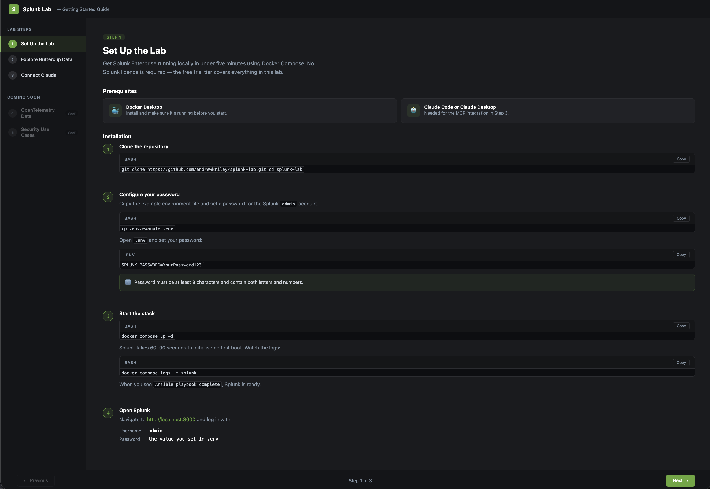
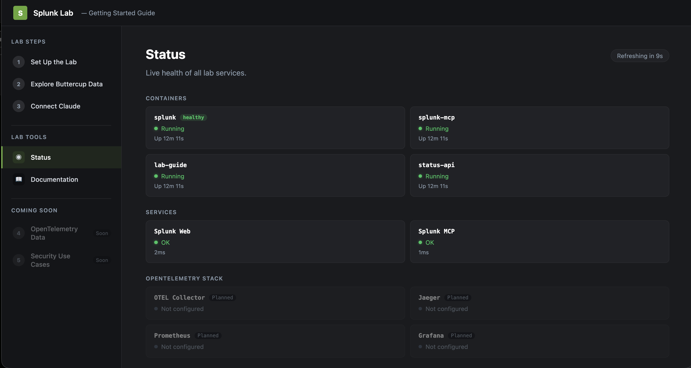

# Splunk Lab

A demo environment for anyone looking to get a kick start with their Splunk learning journey in a self-hosted environment. Runs Splunk Enterprise in Docker with Buttercup Games sample data pre-loaded and the Splunk MCP server ready for Claude Code or Claude Desktop.

```
docker compose up  →  Lab guide + Splunk Web UI + MCP server ready
```

**Lab guide (online preview):** https://andrewkriley.github.io/splunk-lab/

---

## Lab Guide

The lab guide at `http://localhost:3131` is the single interface for the lab. It includes guided setup steps, SPL exercises, a live status dashboard, and documentation — all in one place.

### Lab Steps

Step-by-step walkthrough: clone the repo, configure credentials, start the stack, and connect to MCP.



### Status Dashboard

Live health of all lab services — container states, Splunk Web and MCP reachability, and OpenTelemetry stack placeholders. Auto-refreshes every 10 seconds.



---

## Prerequisites

- [Docker Desktop](https://www.docker.com/products/docker-desktop/) installed and running
- [Node.js](https://nodejs.org/) installed on the host machine (required for MCP integration)
- Claude Code or Claude Desktop (for MCP integration)
- A [Splunk Developer License](https://dev.splunk.com/enterprise/dev_license/) (free) to remove the 500 MB/day indexing limit

---

## Quickstart

**1. Clone and configure**

```bash
git clone <this-repo>
cd splunk-lab
cp .env.example .env
```

Open `.env` and set a password for the Splunk `admin` account:

```
SPLUNK_PASSWORD=YourPassword123
```

> Password must be at least 8 characters and contain letters and numbers.

**2. Start the lab**

```bash
docker compose up -d
```

Splunk takes ~60–90 seconds to initialise on first boot. Watch readiness:

```bash
docker compose logs -f splunk
```

When you see `Ansible playbook complete`, Splunk is ready.

**3. Open the lab**

- **Lab Guide:** http://localhost:3131 — click-through setup and search guide
- **Splunk Web UI:** http://localhost:8000
- **Username:** `admin`
- **Password:** the value you set in `.env`

Buttercup Games sample data is automatically indexed at startup — no manual steps required.

---

## What's included

### Buttercup Games sample data

Three datasets are auto-indexed into the `buttercup` index:

| Sourcetype | Description |
|---|---|
| `buttercup_web` | Web storefront access logs (Apache Combined format) |
| `buttercup_sales` | Vendor sales transactions — units, revenue, product |
| `buttercup_products` | Product catalogue with prices and categories |

**Try these searches in Splunk:**

```spl
# Traffic by HTTP status code
index=buttercup sourcetype=buttercup_web | stats count by status

# Sales revenue by vendor
index=buttercup sourcetype=buttercup_sales | stats sum(revenue) as total_revenue by vendor | sort -total_revenue

# Top products by units sold
index=buttercup sourcetype=buttercup_sales | stats sum(units_sold) as total_units by product | sort -total_units

# Revenue trend over time
index=buttercup sourcetype=buttercup_sales | timechart span=1d sum(revenue) by vendor
```

### Lab Guide and Status Dashboard

The lab guide runs at `http://localhost:3131` and serves as the single interface for the lab:

- **Steps 1–3** — click-through setup and guided SPL exercises
- **Status** — live dashboard showing container health, Splunk Web and MCP service reachability, and OpenTelemetry stack placeholders (auto-refreshes every 10s)
- **Documentation** — reference material for the lab

The status backend (`status-api`) runs as a sidecar container and exposes `GET /api/status` via the nginx reverse proxy — no separate port required.

---

## Importing your own data

### From a CSV file

1. In Splunk Web, go to **Settings → Add Data → Upload**
2. Select your CSV file
3. Splunk will auto-detect the delimiter and preview the fields
4. Set the **Source Type** to `csv` (or create a custom one)
5. Choose the `main` index and click **Review → Submit**

Your data is immediately searchable:
```spl
index=main sourcetype=csv | head 20
```

### From an online source (HEC)

The HTTP Event Collector (HEC) is pre-enabled on port `8088`. Use the token from your `.env` file to send events from any HTTP client:

```bash
# Send a single event
curl -k https://localhost:8088/services/collector/event \
  -H "Authorization: Splunk ${SPLUNK_HEC_TOKEN}" \
  -d '{"event": {"message": "hello from HEC", "source": "my_app"}, "sourcetype": "my_sourcetype"}'
```

```bash
# Send a batch of events from a JSON file
curl -k https://localhost:8088/services/collector/event \
  -H "Authorization: Splunk ${SPLUNK_HEC_TOKEN}" \
  -d @events.json
```

Then search for your events:
```spl
index=main sourcetype=my_sourcetype
```

---

## MCP Integration

The Splunk MCP server runs as a container alongside Splunk and exposes an SSE endpoint at `http://localhost:8050/sse`. It gives Claude direct access to Splunk search, dashboards, and alerts.

> **Known issue:** MCP client support is evolving. See [issue #17](https://github.com/andrewkriley/splunk-lab/issues/17) for known limitations and planned client additions.

> **Security note:** The MCP endpoint requires no authentication and is bound to `127.0.0.1` only — it is not accessible from other machines on the network. This configuration is intentional for local demo use. Do not expose port `8050` to external networks.

> **Why mcp-remote?** Claude Code and Claude Desktop require HTTPS for direct SSE connections. Since the lab MCP server uses plain HTTP on localhost, [`mcp-remote`](https://www.npmjs.com/package/mcp-remote) is used as a local stdio proxy — Claude talks to it over stdio, and it forwards requests to `localhost:8050` over HTTP. No SSL involved. Node.js must be installed on the host for `npx` to work.

### Claude Code

The project ships with `.claude/settings.json` pre-configured. No setup required — the MCP server is automatically available when you open Claude Code in the `splunk-lab` directory with the stack running.

If you need to add it manually:

```json
{
  "mcpServers": {
    "splunk": {
      "command": "npx",
      "args": ["-y", "mcp-remote@0.1.38", "http://localhost:8050/sse"]
    }
  }
}
```

Then start a conversation:
> *"Search Splunk for HTTP 500 errors in the last 24 hours"*
> *"Show me the top 5 vendors by revenue this week"*
> *"Create a dashboard showing web traffic by status code"*

### Claude Desktop

Open your Claude Desktop config file:
- **macOS:** `~/Library/Application Support/Claude/claude_desktop_config.json`
- **Windows:** `%APPDATA%\Claude\claude_desktop_config.json`

Add the following `mcpServers` block:

```json
{
  "mcpServers": {
    "splunk-lab": {
      "command": "npx",
      "args": ["-y", "mcp-remote@0.1.38", "http://localhost:8050/sse"]
    }
  }
}
```

Restart Claude Desktop — the Splunk tools will appear in the tool list whenever the lab stack is running.

---

## Stopping and resetting

```bash
# Stop containers (data is preserved)
docker compose down

# Stop and delete all data (full reset)
docker compose down -v
```

---

## Ports

All ports are bound to `127.0.0.1` and are only accessible from this machine.

| Port | Service |
|---|---|
| `3131` | Lab Guide |
| `8000` | Splunk Web UI |
| `8088` | HTTP Event Collector (HEC) |
| `8089` | Splunk REST API |
| `8050` | Splunk MCP Server (SSE) |
